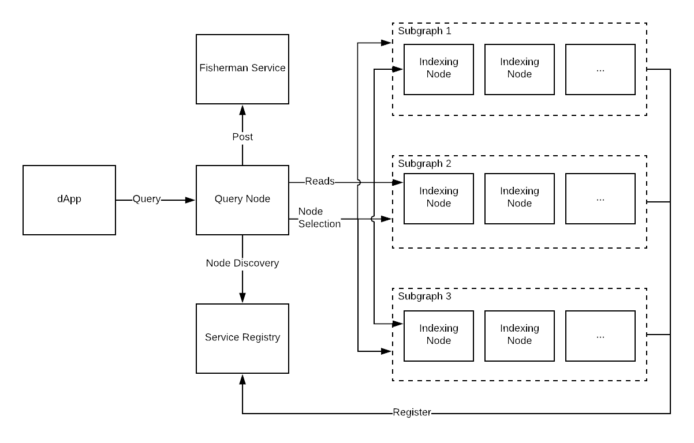
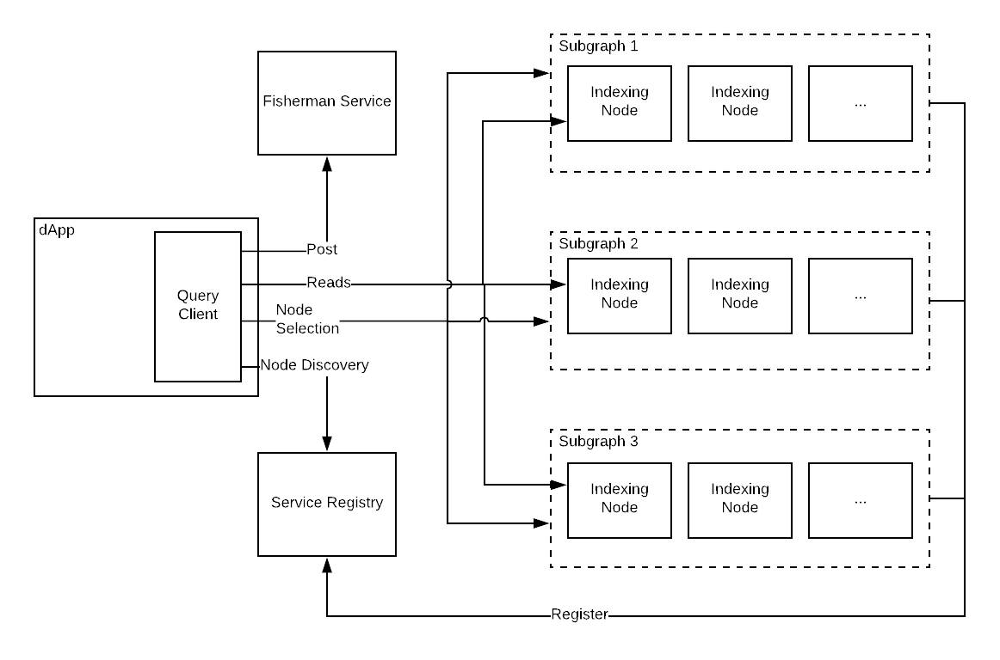

# Query Processing

## Background
In some respects, The Graph resembles a traditional distributed query engine, where users may retrieve data which is distributed across a variety of stores via a single query interface (typically SQL).

In this analogy, Query Nodes play the role of query engine, and Indexing Nodes play the role of data stores.

Importantly, the protocol only defines the *read interface* to the Indexing Nodes, which is consumed by the Query Nodes, while remaining agnostic to the actual implementation of the Query Nodes.

Some Query Node implementations may provide a SQL interface, while others may provide a GraphQL interface. Query Nodes may implement different heuristics for balancing the requirements of price, performance and economic security, or make these algorithms pluggable. Indeed some users may choose to forgo the Query Node altogether, and directly consume the lower-level read interface exposed by the Indexing Nodes.

While this last case is certainly possible, we present here the architecture and high level algorithms for consuming the data indexed by The Graph via a distributed query engine, as that is the intended usage pattern of the protocol.

The specification will omit detailed steps in the algorithms which are left to implementers; however, The Graph team will implement a reference Query Node/ Client which provided a concrete example of how these algorithms might be implemented in order to provide a GraphQL interface to The Graph.

## Query Processing Architecture

### With Query Node

### With Query Client

## Overview
As shown in the diagrams above, the query processing may take place via a Query Client which is embedded in the end-user application, or it may take place via a Query Node which is external to the application. In the latter case, the Query Node may be running locally on the users machine, or it may be running as an external service which is accessed via the internet.

In either construction, query processing consists of the following steps:
1. Query Planning (Optional)
1. Service Discovery
1. Service Selection
1. Processing and Payment
1. Response Collation

## Design

### Query Planning
In this stage the Query Node transforms a query into a plan, consisting of an ordered set of lower-level read operations which may be used to retrieve the data specified by the query. These steps are encapsulated in some intermediate representation (IR).

| Implementors Note |
| ----------------- |
| Query planning is optional. For example, producing a query plan is common for most SQL databases, but for GraphQL server implementations it is common to directly process the query in field-level resolvers. |

## Query Optimization
Query plans may optionally be optimized based on a variety of heuristics and algorithms which are out of the scope of this specification.

### Service Discovery
Processing a query plan, or processing a query directly, results in low-level read operations being made to Indexing Nodes. Each read operation corresponds to a specific dataset, and thus needs to be made against an Indexing Node for that dataset. In the Service Discovery step, the Query Node locates Indexing Nodes for a specific dataset, as well as important metadata useful in deciding which Indexing Node to issue read operations to, such as price, performance, and economic security margin.

#### Locating Indexing Nodes
In order to locate Indexing Nodes with data for a specific dataset, the Query Node makes several calls to the service discovery layer, which is implemented as several smart contracts on the Ethereum mainnet (see Smart Contract Architecture):

1. Resolve subgraph names via the Graph Name Service (GNS).
1. Identify per-subgraph Indexing Nodes via the Staking Contract.
1. Identify Indexing Node URLs via the Service Registry.

#### Collecting Indexing Node Metadata
After identifying the URLs of all Indexing Nodes for a given dataset, the next step is to collect metadata around price, performance, and economic security margin. This information should be cached for future Service Discovery steps for subsequent queries.

Fetching price and latency for a node is done via a single call to the Indexing Node RPC API, and returns the following data: the latency required to fulfill the request; a `bandwidthPrice` measured in price per Byte transmitted over the network; and a `gasPrice` which captures the cost of compute and IO for a given read operation.

Economic security margin is the amount that an Indexing Node has staked and is willing to forfeit in the event that they provide an incorrect response to a read operation. The Query Node receives this in the previously made call to the Staking Contract.

| Implementors Note |
| ----------------- |
| The Query Node need not make calls to every Indexing Node for a given dataset. It could choose to only contact a randomly selected subset, or to keep contacting Indexing Nodes until it find one which meets its selection criteria|

### Service Selection
In the Service Selection stage, Query Nodes choose which Indexing Nodes to transact with for each read operation. An algorithm for this stage could incorporate `latency` (measured in ms), `economicSecurityMargin` (measured in Graph Tokens), `gasPrice` and `bandwidthPrice`.

A naive algorithm for service selection could look like the following:
1. Filter out all Indexing Nodes where `economicSecurityMargin < minEconomicSecurityMargin`.
  - If no Indexing Nodes remain, return an error to the sender of the Query for this piece of data, and specify reason.
1. Filter out all Indexing Nodes where `latency < minLatency`.
  - If no Indexing Nodes remain , increase `minLatency` by 33% and repeat step.
1. Estimate cost of read operation for each remaining Index.
  - Assume 80% of the maximum possible entities returnable by the query will be returned.
  - Assume 25% the max field size (in Bytes) for each entity field with variable size.
  - Calculate bandwidth and gas costs based on the above assumptions, and the gas costs specified in the Read Interface.
1. Choose Indexing Node with lowest estimated cost for the read operation.

In this example algorithm, `minLatency` and `minEconomicSecurityMargin` could be set per dataset, or for all dataset. Additionally it could be set by the Query Node or sent as metadata with an individual query.

### Processing and Payment
Individual read operations are made against Indexing Nodes via the Read Interface. They are accompanied by conditional micropayments as described in the Payment Channels section of the specification.

**TODO** Add link to Read Interface.

**TODO** Add link to Payment Channels section.

### Response Collation
Once all read operations have been processed, the resulting data must be collated into a response which fulfills the read schema of the query interface provided by the Query Node. This response is then returned to the sender of the query.
