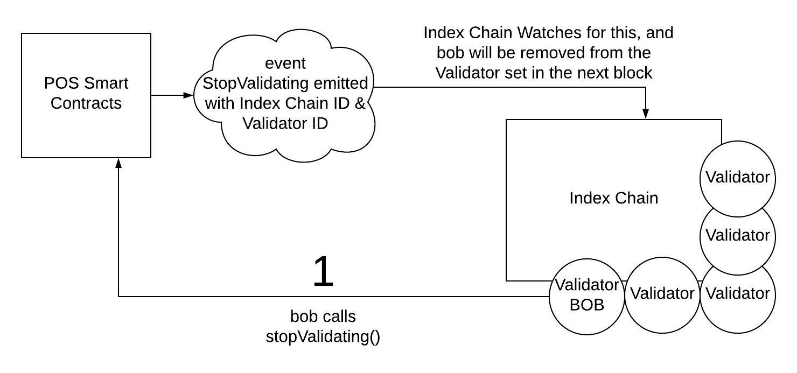
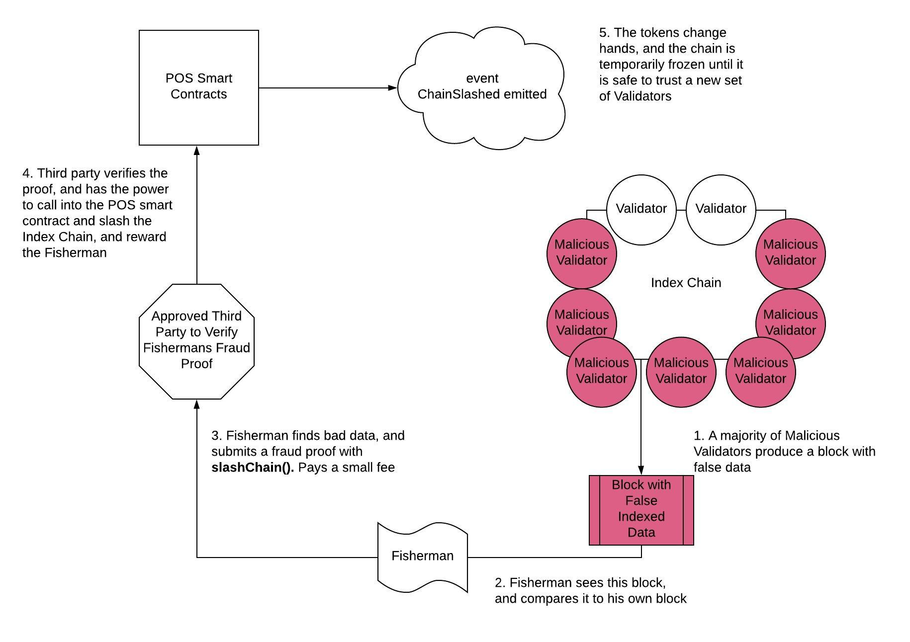

# Graph Network Proof-of-Stake (POS) Technical Specification

## Table of Contents

* [Introduction](#introduction)
* [Types and Parameters](#types-and-parameters)
* [Stakeholders](#stakeholders)
* [Proof-of-Stake Smart Contract](#pos-smart-contracts)
* [Staking](#staking)
* [Rewards](#rewards)
* [Slashing](#slashing)

---

## Introduction

The Graph Network uses Proof-of-Stake (POS) to achieve economic finality by incentivizing a group of distributed nodes to come to consensus on Index Chain data. Proof-of-Stake is a blockchain incentivization protocol. Stakeholders can vote proportional to their stake they have in the network. With the Graph Network the staking is done with Graph Tokens, and the nodes which are staking are called **Validators**.

Each Index Chain has its own set of Validators. When a user owns Graph Tokens, they can stake them on the Ethereum Mainnet, and become a Validator of an Index Chain of their choosing. The Graph Network Staking Contracts emits events, and Index Chains are listening for these events to allow Validators to be added to their respective chains. This makes Index Chains Layer 2 blockchains. 

Validators are rewarded for producing valid blocks, and punished for misbehaviour. An Index Chain’s block rewards are proportional to its stake, and how often it is queried.

There are three ways to interact with the POS protocol - staking, rewards, and slashing. The POS protocol will be broken down to examine these three pieces.  

---

## Stakeholders 

Stakeholders are any players that interact with Graph tokens as stake within the network. They are: 

* **Validators**: Users that bond tokens and serve up queries in exchange for rewards and fees.
* **Fishermen**: Submit slash proofs as on-chain evidence of Index Chains that produce false queries, for which they are rewarded a fee.

## Types and Parameters

The types listed below are high level protocol data types. 

### Network Data Types

The network data types provide important information on tokens staked, Index Chains, and Validators. 

| Network Data Types (The Pool)   | Type    | Description                                                                                                                                     |
| ------------------------------- | ------- | ------------------------------------------------------------------------------------------------------------------------------------------------|
| Total Staked                    | uint256 | The total amount of Graph Tokens staked within the network.                                                                                     |
| Loose Tokens                    | uint256 | The total amount of Graph Tokens within the POS smart contract, but not staked (i.e. thawing or otherwise).                                     |
| Total Tokens                    | uint256 | The total amount of Graph Tokens that exist within the network.                                                                                 |
| Index Chain List                | mapping | The list of all Index Chains that are currently staked within the network.                                                                      |
| Validator Set                   | mapping | The Validator set of each Index Chain. There is a Validator set for each Index chain                                                            |
| Next Reward                     | uint256 | The next time (unix) that the reward can be withdrawn (daily).                                                                                  |
| Previous Reward Claim           | uint256 | The last time (unix) that the reward was withdrawn.                                                                                             |

### Block Data Types

Block data types deal strickly with blocks, on both the mainnet and the Index Chains. 

| Block Data Types                | Type    | Description                                                                                                                                     |
| ------------------------------- | ------- | ------------------------------------------------------------------------------------------------------------------------------------------------|
| Block Number (Mainnet)          | uint256 | Indicates the block number of the blockchain the POS smart contract is on.                                                                      |
| Block Number Index Chain        | uint256 | Indicates the block number of the Index Chain.                                                                                                  |
| Block Reward                    | uint256 | The total number of tokens rewarded per a mainnet block.                                                                                        |

### Validator Data Types

Validator data types define all important Values of a Validator

| Validator Data Types            | Type    | Description                                                                                                                                     |
| ------------------------------- | ------- | ------------------------------------------------------------------------------------------------------------------------------------------------|
| Validator Address (Mainnet)     | address | The address of the mainnet account that has staked Graph Tokens.                                                                                |
| Validator ID (Index Chain)      | Bytes   | The Validator ID, which is produced by The Graph Network client, and used to connect to an Index chain.                                         |
| Bonded Amount                   | uint256 | The amount of Graph Tokens a Validator has staked.                                                                                              |
| Bonded Shares                   | uint256 | The bonded shares represent a Validators share of the total tokens that they have staked.                                                       |
| Status                          | enum    | The status of the Validator can be - `Bonded`, `Unbonding`, and `Revoked`.                                                                      |
| Thawing Tokens                  | uint256 | The amount of tokens the Validator has thawing.                                                                                                 |
| Bond Height                     | uint256 | The block number (mainnet) that the Validator began Validating.                                                                                 |

### Network Parameters

Network Parameters can be set at the protocol level to fine tune how the POS protocol functions. At first they will be controlled by a multisig address, and eventually they will be adjusted by governance. 

| Network Parameters              | Type    | Description                                                                                                                                     |
| ------------------------------- | ------- | ------------------------------------------------------------------------------------------------------------------------------------------------|
| Thawing Period                  | uint256 | The period of time (unix) that tokens must be frozen before withdrawal. Must be used to prevent long-range attacks.                             |
| Minimum number of Validators    | uint256 | The minimum number of Validators required for an Index Chain to be part of the network.                                                         |
| Maximum Number of Validators    | uint256 | The maximum number of Validators an Index Chain is allowed to have.                                                                             |
| Maximum Number of Index Chains  | uint256 | The maximum number of Index Chains allowed to connect to the POS Smart contract. Must be limited do to technological constraints.               |
| Target Bonded Ratio             | uint256 | The ratio that is desired to stabilize the network. Max and Min Inflation Rate are used to hone in on the TBR.                                  |
| Maximum Inflation Rate          | uint256 | The maximum the protocol will allow tokens to be inflated (yearly).                                                                             |
| Minimum Inflation Rate          | uint256 | The minimum the protocol will allow tokens to be inflated (yearly).                                                                             |
| Leader Minting Reward           | uint256 | The reward the Leader Validator gets from calling the mintInflation() on mainnet. It is a percentage of the daily reward. This covers gas.      |
| Double Sign Slash %             | uint256 | The % value of the Validators stake to be slashed upon evidence of double signing (will likely be large).                                       |
| Liveness Fault Slash %          | uint256 | The % value of the Validators stake to be slashed upon Liveness Faults (will likely be small).                                                  |
 
---

## Proof-of-Stake Smart Contract

The staking smart contract is the interface that connects Ethereum (Layer 1) to the network of Index Chains (Layer 2).

It stores all Index Chain information, as well each chains Validator Set. Each Validator of an Index Chain will have their **Validator ID** mapped to their Ethereum account, as they provide this information to the staking smart contract. 

It is designed to punish bad behaviour by slashing, and to reward good behaviour with inflationary block rewards. It is also designed to positivly incentivize all stakeholders to claim their rewards in a pulling manner, and pay for their own gas fees when possible, as this is a much simpler design. 

### Connecting Multiple POS Index Chains

The diagram below shows the staking smart contract as the connection point for all Index Chains:

The smart contract will map the follow data structures:

    SubgraphID     --> Index Chain IDs

    Index Chain ID --> Validator Set
 
    Validator      --> Stake 

Each SubgraphID has a list of the Index Chains within it. Each of those chains has a Validator set, representing the nodes securing the network. Each Validator has a stake in Graph Tokens. This design allows for an organized way to see how much is at stake, per Validator, and per Index Chain. 

### Round Progression and Checkpointing

Each round is a day long. A round can contain many blocks, it will depend on how long the block times of the Index Chain are. Block times will vary depending on what data is being indexed, and from which blockchain. 

The Index Chain will have to be checkpointed to the POS smart contract. The simplest implementation is to checkpoint every single Index Chain blockhash to mainnet. However, this can get expensive to continually checkpoint on mainnet, especially with multiple Index Chains. Therefore groups of blocks, called `epochs`, will be checkpointed.
 > TODO: explain `epochs` better. A better understanding of the consensus protocol is needed though, as chain based consensus would help with this design. 

---

## Staking

The Index Chains watch for events emitted from the Ethereum network to become informed when a change to the Validator Set occurs. Events are used because they are Ethereum's primary way of communicating with outside the protocol. The event emitted will give the Index Chain the information it needs to allow a new Validator to join the Index Chain. 

### Bonding to Become a Validator

A `becomeValidator()` message consists of the following parameters:

| Parameter                       | Type    | Description                                                                                                                                     |
| ------------------------------- | ------- | ----------------------------------------------------------------------------------------------------------------------------------------------- |
| Bond Amount                     | uint256 | The amount of Graph Tokens being staked. Must be large enough to put the new Validator in the top Validator set.                                |
| Validator Address               | address | The address that the validator is using for the smart contract platform (i.e. Ethereum).                                                        |
| Validator ID                    | uint256 | Each Validator has a unique ID they get from the Index Chain. The Validator must share this with the smart contract.                            |
| Index Chain ID                  | address | The Index Chain ID is unique to each Index Chain. This allows the smart contract to create a list of each Index Chain.                          |

Let's describe the diagram above. A user with Graph Tokens finds an Index Chain they would like to validate on, then they follow Step 1:

1. They confirm they meet the requirements to stake, then call the staking contract function `registerValidator()`. They pass data that indicates which Index Chain they will Validate on. This includes the Index Chain ID, their Validator ID, and the amount of Graph Tokens to stake. Once the `registerValidator()` transaction is included in the main chain, it will emit an event:

        Event NewValidator( 
            indexChainID, 
            validatorID, 
            mainnetAddress, 
            tokensStaked 
        )

The Index Chain is listening to the staking smart contract for the `NewValidator` event that contains it's own `IndexChainID`. The event data will be read, and the Index Chain Validator Set will be updated. The Index Chain Node ID allows the new Index Chain Node to become a Validator. Next is Step 2:

2. The new Validator runs a CLI command in The Graph Network software and it adds the node as a Validator.

### Unbonding to Stop Validating 

A `stopValidating()` message consists of the following parameters:

| Parameter                       | Type    | Description                                                                                                                                     |
| ------------------------------- | ------- | ----------------------------------------------------------------------------------------------------------------------------------------------- |
| Validator Address               | address | The address that the validator is using for the smart contract platform (i.e. Ethereum).                                                        |
| Validator ID                    | bytes   | Each Validator has a unique ID they get from the Index Chain. The Validator must share this with the smart contract.                            |
| Index Chain ID                  | bytes   | The Index Chain ID is unique to each Index Chain. This allows the smart contract to create a list of each Index Chain.                          |

A Validator can stop validating with one call to the POS smart contract:

1. The Validator calls `stopValidating()` with their Validator ID, and Index Chain ID. Next the Event `StopValidating` will be emitted: 

        Event StopValidating(
            indexChainID, 
            validatorID, 
            mainnetAddress, 
        )

The Index Chain Validators are listening for such events, and every Validator will then include an update to the Validator Set in the next block. When a majority consensus is reached, the Validator set will be updated, the Validator will no longer participate in consensus, and their tokens will enter the thawing period. 

### Rebonding Frozen Tokens

When a Validator unbonds tokens, they get put through a thawing period, which could be weeks or months long, depending on how the network parameter is set. A Validator is free to rebond tokens that are frozen, with no wait time. This could happen from voluntary unbonding, or from being unbonded due to [liveness faults.](#slashing-validators)

### Changing Stake 

A Validator may want to increase or decrease their stake of their node. This is done by calling `changeStake()` on the POS smart contract. If they are adding stake, it will be added as soon as it can be included in a block. If they are lowering their stake, the tokens must go through the thawing period before they can be released from the POS smart contract. 

A `changeStake()` message consists of the following parameters:

| Parameter                       | Type    | Description                                                                                                                                     |
| ------------------------------- | ------- | ----------------------------------------------------------------------------------------------------------------------------------------------- |
| Change Amount                   | uint256 | The amount of Graph Tokens being added or subtracted.                                                                                           |
| Increase Stake                  | boolean | True if increasing the stake, false if lowering the stake.                                                                                      |
| Validator Address               | address | The address that the validator is using for the smart contract platform (i.e. Ethereum).                                                        |
| Validator ID                    | uint256 | Each Validator has a unique ID they get from the Index Chain. The Validator must share this with the smart contract.                            |
| Index Chain ID                  | address | The Index Chain ID is unique to each Index Chain. This allows the smart contract to create a list of each Index Chain.                          |

---

## Rewards

> Note - fees are being left out for now, as well as how queries are calculated into the staking. This section is more about the POS protocol, not the interconnectedness of staking and queries. However it may be appropriate to add this in the future, but right now it is up in the air. 

Block rewards are created in order for Validators to receive compensation. This happens on the Ethereum mainnet. With The Graph Network, there needs to be a simple way to pass down the rewards to each Index Chain, and then within each Index Chain, each Validator needs to be rewarded their appropriate amount. 

The minimum and maximum Inflation pecentage is set at the parameter level, first by a multisig controlling account, and eventually by governance voting. The **Current Inflation Rate** will be continuously adjusted, as it aims to match the [**Target Bonded Ratio**](#Network-Parameters).

### Pool of Shares

The **Pool** is a data structure created to help with efficient distribution of rewards to each Index Chain, and each Validator. It is used to minimize the amount of state updates required to reward each Validator. This lowers gas usage. The Pool of shares are split up based on the share of tokens that a Validator has compared to the total tokens staked. This allows for the ratio to change dynamically, while allowing the Validator to take out the tokens in the future, with only a single state change. The Validator can withdraw their tokens when they please from the Pool. The equation for calculating the shares is as follows:

    __(eq. 1) Inflation Rewards = ( 24 hours / 8766 hours ) * Total Graph Tokens * Yearly Inflation__

### Minting and Claiming Graph Token Rewards

The following specifications are required for minting and claiming in the protocol: 

* Rewards are paid out daily
* A node must call `mintInflationReward()` on mainnet in order to mint the tokens. Leader Validators (see consensus) of each Index Chain are incentivized to call the function, and are rewarded to do so based on the current [Leader Minting Reward](#Network-Parameters)
* The payout depends on both the amount staked, and the total queries that the Index Chain has served each day (see Query Marketplace)
* Each Index Chain is able to prove how many queries it has had by having their leader submit a transaction with the amount of fees the Index Chain has collected in a day (see [Query Marketplace](#))

The basic rewarding of each Index Chain, and the Validators within that Index Chain are shown in the two equations below:

    __(eq. 2) Index Chain Rewards = ( Index Chain Queries / Total Queries ) * Total rewards__

    __(eq. 3) Validator Rewards = ( Validators Stake / Total Validators Stake ) * Index Chain Rewards__
    
The fees paid for each day for the Index Chain, and each Validator are passed along with `mintInflationTokens()`. This information is needed for __(eq. 2)__ and __(eq. 3)__. 

A `mintInflationReward()` message consists of the following parameters:

| Parameter                       | Type    | Description                                                                                                                                     |
| ------------------------------- | ------- | ----------------------------------------------------------------------------------------------------------------------------------------------- |
| Validator ID                    | bytes   | Validators unique ID from their Index Chain.                                                                                                    |
| Index Chain ID                  | bytes   | The Index Chain ID is unique to each Index Chain. This allows the smart contract to create a list of each Index Chain.                          |
| Queries by Index Chain          | mapping | A mapping of the queries that were completed in the previous day by each Index Chain (used to divide the rewards evenly).                       |
| feesPaidChain                   | unit256 | The fees paid for serving queries for each Index Chain. This is used to calculate the rewards for each Index Chain .                            |
| feesPaidValidators              | mapping | The fees paid for by each Validator for an Index Chain. This is used to calculate the rewards for each Validator.                               |

The following diagram shows the process of minting rewards, as well as claiming rewards:

The claiming of rewards must be done by each Validator. When the rewards are minted, they are all placed within the staking smart contract. To do this costs gas, which is why leaders compete to win the reward that covers the gas, and provides them with extra tokens. But to separately send rewards to each Validator requires that the Validators call `claimRewards()`. At this point, they can choose to send the rewards directly to their mainnet account, or to add them to their current stake, with the `Add To Stake` boolean. Each Validator is allowed to accumlate their stake for multiple days. This can save on the gas spent to withdraw. 
> TODO: get more research into this (livepeer does this technique, where they allow one function call to withdraw 30 days worth of rewards)

A `claimRewards()` message consists of the following parameters:

| Parameter                       | Type    | Description                                                                                                                                     |
| ------------------------------- | ------- | ----------------------------------------------------------------------------------------------------------------------------------------------- |
| Add To Stake                    | boolean | If true, add the rewards to the total stake. If false, just send them to the Validators mainnet account.                                        |
| Validator ID                    | bytes   | Validators unique ID from their Index Chain.                                                                                                    |

---
## Slashing
### Slashing Validators

The POS protocol is designed to ensure economic finality. Economic finality ensures that once a block is finalized, the only way for two conflicting blocks to exist is if at least ⅓ of the Validators are willing to lose their stake. This is where slashing comes in. It is an incentivization mechanism to prevent bad behaviour. 

There are two reasons to be slashed:
* **Double Signing** - Occurs when it is proven that a Validator has signed two blocks at the same height. This is because with a ⅔ majority, the only way a fork could happen is if ⅓ sign two blocks, thus creating two valid blocks. This is known as the nothing at stake problem, and slashing is used to mitigate it. The amount slashed is dependant on the [**Double Sign Slash Percentage**](#Network-Parameters) parameter.
* **Liveness Faults** - Are events where > ⅓ of validators are no longer connected to the network due to a network partition, computer failure, or the validators themselves are malicious. This prevents ⅔ majorities from voting on blocks. We deal with this by introducing a small slash, and **Revoking** the Validator. The slash amount is dependant on the [**Liveness Fault Slash Percent**](#Network-Parameters) parameter. This incentives Validators to not go down unexpectedly, and the revoking removes their bonded tokens from the overall calculation of the ⅔ majority. This allows the protocol to continue producing blocks.

> TODO: having second thoughts on burning tokens for liveness faults. Maybe just losing out on inflation rewards is enough of a penalty to incentivize 100% uptime. 
> TODO: is it possible that any validator cannot call slashValidator()? Do we need signature aggregation? how does livepeer do it?

The `slashValidator()` function will be used for both slashing conditions. The liveness fault and double signing slashed tokens will be burnt. Any Validator on the Index Chain can submit `slashValidator()`, and they must provide the proof of that Validators signature for two blocks with the same number. They are incentivized to do so because catching another Validator will remove them from earning inflationary rewards, and therefore increase the inflationary rewards they can earn themselves. It also increases the reputation of the Index Chain, which is good for attracting queries. `slashValidator()` releases the following event: 

        Event ValidatorSlashed(
            slashType,
            tokensSlashed,  
            validatorID, 
            mainnetAddress, 
        )

A `slashValidator()` message consists of the following parameters:

| Parameter                       | Type    | Description                                                                                                                                     |
| ------------------------------- | ------- | ----------------------------------------------------------------------------------------------------------------------------------------------- |
| Validator ID                    | bytes   | The ID of the Validator to be slashed.                                                                                                          |
| Slash Validator Proof           | bytes   | The Proof contains information at a certain Index Chain block height that has false information, which can then be Verified.                    |
| type                            | enum    | Can be a slash of type `doubleSign` or `livenessFault`.                                                                                         |

The messaging diagram is shown below for slashing: 

### Slashing Index Chains

It is possible that an entire Index Chain is acting fradulently, and producing false information as a group, therefore reaching consensus. Fishermen are watching for this. It is the Fisherman's job to watch for this possibility, and submit a Fraud Proof showing that the data the Index Chain Validators agree on does not equate to the real world data. This gets passed up to a third party (currently a multisig address in control by Graph developers) that can then run this exact query, and determine if it is fraudulent. If so, the Fishermen is rewarded 100% of the slashed stake. Only the Fraudulent Validators will be slashed. 

Fishermen must pay a small fee to call the function `slashChain()`, in order to prevent a DDOS attack. `slashChain()` will release the following event upon successful execution:

        Event ChainSlashed(
            tokensSlashed,  
            indexChainID, 
        )

The process of a Fisherman submitting a Fraud Proof for an Index Chain can be seen below: 

A `slashChain()` message consists of the following parameters:

| Parameter                       | Type    | Description                                                                                                                                     |
| ------------------------------- | ------- | ----------------------------------------------------------------------------------------------------------------------------------------------- |
| Chain ID                        | bytes   | The ID of the Validator to be slashed.                                                                                                          |
| Slash Chain Proof               | bytes   | The Proof contains information at a certain Index Chain block height that has false information, which can then be Verified.                    |

If the protocol operates as designed, it would be expected that no group of rational Validators would allow their full stake to be lost. Therefore the Fishermen would never get paid out, and might completely stop doing their job. Random rewards will be generated by each Index Chain, that can be found by Fishermen to reward them for always being on standby. 
